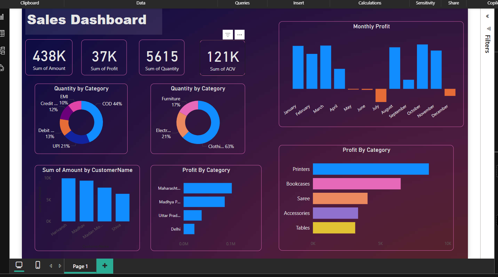

# 📊 Sales Analysis Dashboard – Power BI

This project presents a dynamic **Sales Analysis Dashboard** built in **Power BI**, designed to provide actionable insights into sales performance across time, products, and regions. The report is based on mock sales data and showcases interactive visualizations, key metrics, and filters to explore the data in depth.

---

## 🔍 Project Objective

To analyze sales data and uncover insights that help businesses:
- Track revenue and profit trends over time
- Identify top-performing products and regions
- Monitor customer behavior and order dynamics

---

## 📊 Data Description

This project uses two main datasets to perform sales analysis:

### 1. `Orders.csv`
This dataset contains high-level information about each customer order.

**Key columns:**
- `Order ID`: Unique identifier for each order
- `Order Date`: Date when the order was placed
- `Customer Name`: Name of the customer
- `Segment`: Customer segment (e.g., Consumer, Corporate, Home Office)
- `Region`: Geographic sales region
- `Ship Mode`: Delivery method for the order

### 2. `Details.csv`
This dataset provides line-item level details of the products included in each order.

**Key columns:**
- `Order ID`: Links to the `Orders.csv` file
- `Product Name`: Name of the item sold
- `Category`: Category of the product (e.g., Furniture, Office Supplies)
- `Sales`: Sales value for that product
- `Quantity`: Number of units sold
- `Profit`: Profit from the sale of that product

These two datasets are connected through the **`Order ID`** field to form a relational data model in Power BI, allowing for detailed sales performance analysis across dimensions like time, product, customer segment, and region.

This data is embedded within the `.pbix` file and does not require external files to open or explore the report.

---

## 📈 Key Features

- **KPI Cards**: Total Revenue, Profit, and Orders
- **Time Series Visualization**: Monthly sales and profit trends
- **Top Products Analysis**: Best-sellers by revenue and quantity
- **Regional Breakdown**: Map and bar chart views by region
- **Customer Segmentation**: Performance by customer type
- **Interactive Filters**: Slicers for category, date range, and region

---

## 🧠 Insights Discovered

- 📈 **Revenue Growth**: Total revenue showed an upward trend throughout the year, with significant spikes in Q2 and Q4.
- 🥇 **Top Products**: Product categories like "Electronics" and specific items like "Laptops" contributed most to sales.
- 🌍 **Regional Trends**: The Western region led in total sales, but the Southern region had higher average profit per order.
- 💡 **Profitability**: Some high-sales products had lower profit margins — highlighting opportunities to improve pricing or reduce costs.
- 🔄 **Customer Behavior**: Corporate customers made fewer but higher-value purchases compared to individual consumers.
- 📆 **Seasonality**: Higher sales observed in mid-year and end-of-year periods, indicating promotional or seasonal effects.

---

## 🛠 Tools Used

- **Power BI Desktop**
- **DAX Measures** for dynamic KPIs (e.g., Profit Margin %, YoY Growth)
- **Interactive Visuals**: Line charts, stacked bars, maps, and slicers

---

## 📂 How to View the Report

- Download and open the `.pbix` file in [Power BI Desktop](https://powerbi.microsoft.com/desktop/)
- Use the slicers and visuals to explore the dataset and insights interactively

## 📎 File

- `sales analysis.pbix` – Power BI project file (attached in this repo)

## 🚀 Author

**Your Name**  
📧 ppurvi170@gmail.com
💼 [LinkedIn](https://linkedin.com/in/yourprofile) 

---

> ✅ *This report is for demo/portfolio purposes only. All data used is fictional.*

